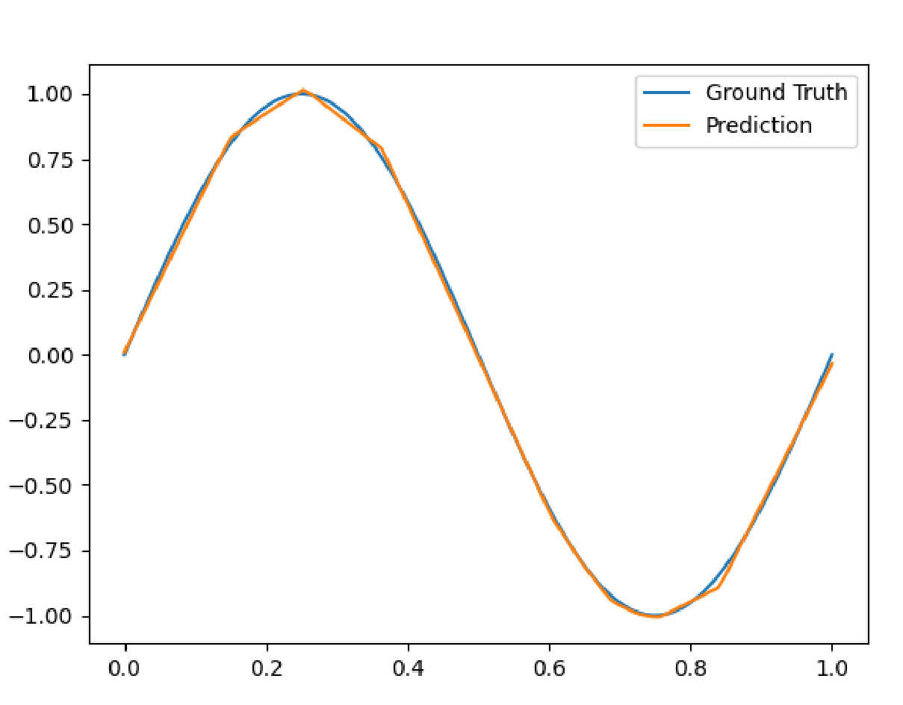

# Hydra Cluster Example

This repository contains a simple example of a Hydra project and how to use it with a Slurm cluster and WandB integration. This Readme will serve as a tutorial to walk you through the individual steps.

## Installation
Create a new virtual environment (using conda, mamba, or virtualenv) and install the repository as a local package
(from the root of the repository):
```bash
pip install -e .
```
## Project Source Code
Have a look at the source files in the `src` directory and the `main.py` entry point. This projects implements a simple 1d regression task with a MLP model using torch and should
be fairly easy to understand with a fundamental machine learning background. Notice that every class takes as an input a config dict. This is a common pattern in Hydra projects.

## Hydra Concept
Hydra is a powerful framework for configuring complex applications. It allows you to define  hyperparameter configurations 
and compose them in a hierarchical way. This is particularly useful when you want to combine experiments from multiple sub modules.

For example, you can define your algorithm and your dataset as separate modules and then combine them in a single experiment.
In this repository, we have 2 different datasets (Line or Sine 1d regression) and a simple MLP model as our algorithm.

The entry point of the project is the `main.py` file. In order to execute it, you have to provide a config file. You do this as a command line argument:
```bash
python main.py --config-name exp_1_local_sine
```
This executes the `main.py` script with the configuration `exp_1_local_sine` which is defined in the `configs` directory.
Taking a look at the config file, you can see that it first loads different subconfigs:
```yaml
defaults:
  - algorithm: mlp
  - dataset: sine
  - platform: local
  - _self_
```
After that, it sets specific paramters or overwrites default values:
```yaml

epochs: 1000
device: cuda
name: exp_1_local_sine
group_name: local
visualize: True
wandb: False
seed: 100
```
Importantly, in the `- platform: local` config, we define where the experiments should be saved. If you take a look at the config itself (`configs/platform/local.yaml`), you see that it starts with the line
```yaml
# @package _global_
```
This means, that it this config is "moved" to the global config level and that its keys are in the root level of the config instead inside the `platform` key.
We need that since the `hydra:` key needs to be in the root level of the config file.

## WandB Integration
This project is integrated with "Weights and Biases" (WandB). WandB is a great tool for tracking your experiments and visualizing your results. In order to use it, you have to create an account on the WandB website and get your API key.
Then, you can set your API key as an environment variable, WandB will tell you how to do this when you run it for the first time.

When you change the config `configs/exp_1_local_sine.yaml` and set the key `wandb: True` we will log our results to WandB.
Try it out by running this config again! You should see a new run in your WandB dashboard. However, the train loss curve is not very informative. 
You can change the y-axis to a logarithmic scale to see the loss better:
Hover over the train loss plot and click "Edit panel". Find the "Y Axis" option and tick the "Log Scale" button to the right.
Now you should see the loss curve better.

2 Things are recommended to change in the WandB GUI:
1. Group your runs to "Group" and "Job Type":


    Groups are bigger gropus of runs, while Job Type can be seen as a sub group of a group. In our case, a job type only contains the same configuration, but we save multiple executions with different seeds in it.
2. Go to "Settings" (top right) -> "Line Plots" -> Tick "Random sampling" to see the correct grouping of multiple runs.


### Comparing Experiments on WandB
If you now start the second experiment `exp_2_local_relu` you will see that the runs are grouped by the "Group" and "Job Type" and that the line plots are correctly displayed.
Compare both runs. You should observe that ReLU converges faster than Tanh activation function (which was used by exp_1):


However, the ReLU prediction is a step wise linear function and looks janky, if you take a look a the the prediction plot:


This can be all easily compared in the WandB GUI. Hopefully, this helps you to get a better understanding of your experiments.

## Hydra Sweeper and Multirun
Hydra also provides a powerful tool for defining multiple experiments at once. Useful applications are hyperparameter grid search or rerunning your experiment with different seeds.
This is done with the `MULTIRUN` flag.

Take a look at `configs/exp_3_local_multirun.yaml`. It has this new section:

```yaml
hydra:
  mode: MULTIRUN
  sweeper:
    params:
      seed: 0, 1, 2  # starts 3 jobs sequentially, overwrites seed value
```
With this configuration, we start 3 jobs sequentially with different seeds. This is useful if you want to increase the statistical significance of your results.

Once you run this config, you should see in WandB now an aggregated line plot of these 3 runs.


Specific aggregation methods can be changed by the "Edit panel" option.

The `sweeper` section can be used to define a grid search: It creates a cartesian grid of all combinations given in the params dict.
If you are interested in a "list"/"tuple" search, check out my repository
[hydra-list-sweeper](https://github.com/ALRhub/hydra_list_sweeper).

## Slurm Cluster

Now we are ready to deploy our code on a Slurm cluster. We will use the BwUni Cluster as an example cluster, but every Slurm cluster should work similarly.
As a general rule, all runs on the cluster are only executed using the MULTIRUN mode.

The first step is to log in on the cluster, clone this repository and install it in a virtual environment. Then you are ready to submit your first job. 

### Submitting your first Job
Hydra has a nice plugin to submit slurm jobs, where you don't have to touch any bash scripts. We configure the parameters of that in the `platform` subconfig.
Take a look at `configs/platform/bwuni_dev_gpu_4.yaml`:
```yaml
# @package _global_

defaults:
  - override /hydra/launcher: submitit_slurm

hydra:
  mode: MULTIRUN  # needed for launcher to be used
  run:
    dir: ./outputs/training/${now:%Y-%m-%d}/${name}
  sweep:
    dir: ./outputs/training/${now:%Y-%m-%d}
    subdir: ${name}/seed_${seed}
  launcher:
    # launcher/cluster specific options
    partition: "dev_gpu_4"
    timeout_min: 30 # in minutes, maximum time on this queue
    gres: gpu:1  # one gpu allocated
    mem_per_gpu: 94000  # in MB
    additional_parameters:
      cpus-per-task: 4  # maybe more?
```
This configuration tells Hydra to use the `submitit_slurm` launcher and to submit the job to the `dev_gpu_4` partition. In the `launcher` section,
you can specifiy the timeout (how long the job is allowed to run), the number of gpus, the memory per gpu, and additional parameters like the number of cpus per task.
On the `dev_gpu_4` queue, jobs are limited to 30 minutes.

Now, you can submit the job by executing the following command on the cluster:
```bash
python main.py --config-name exp_4_bwuni_dev
```
This config is similar to the local multirun config, but it uses the bwuni platform config. You should see a new job being submitted to the cluster.
Check their status using `squeue`. Normally, they should deploy within a few minutes. The results are plotted to wandb again.

### Submitting the Job on the Real Queue
The dev queue is nice for debugging, but due to the time limit of 30 minutes, it is not practical for real experiments.
The `config/exp_5_bwuni.yaml` config uses the `bwuni_all_gpus` platform, which submits the job to all possible gpu queues.
Try to run this config on the cluster. The waiting time might now be much longer. In general, a shorter timeout_min results in a higher priority.
Another useful command to get an upper bound of the waiting time is `squeue --start`. To find out which partitions are currently idle, check out `sinfo_t_idle`.

# Conclusion
This repository showed you how to use Hydra, WandB, and Slurm together. This is a powerful combination to manage your experiments and to deploy them on a cluster.
I hope this tutorial was helpful to you. If you have any questions, feel free to contact me. (philipp.dahlinger@kit.edu)

